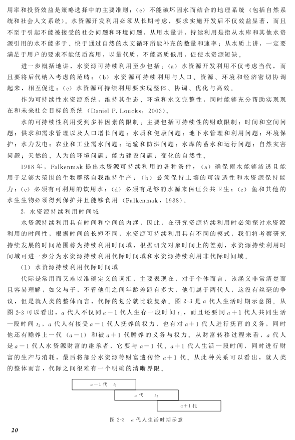
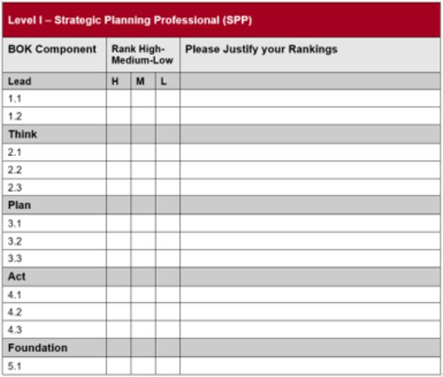
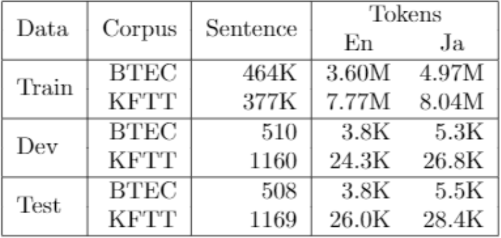

<h3 align="center"> Datasets for </h3>
<h1 align="center"> Table Structure Recognition </h1>

<h2> 🗒️List of Index </h2>

- [ICDAR2013](#icdar2013)
- [Marmot](#marmot)
- [PubTabNet](#pubtabnet)
- [TableBank](#tablebank)
- [SciTSR](#scitsr)
- [WTW](#wtw)
- [ICDAR-2019](#icdar-2019)
- [SynthTabNet](#synthtabnet)
- [FinTab](#fintab)

 

# ICDAR2013

    <a href="https://guillaumejaume.github.io/FUNSD/work/">
        </img>
    </a>
    </img>
    </img>

 

<table align=center>
    <th colspan=3>Number of Samples</th>
    <th rowspan=2>Type</th>
    <th rowspan=2>Access Link</th>
    <th rowspan=2>Evaluation Metric</th>
    <tr>
        <th>Train</th>
        <th>Validate</th>
        <th>Test</th>
    </tr>
    <tr>
        <td>-</td>
        <td>-</td>
        <td>156</td>
        <td>Image from PDF</td>
        <td rowspan=2>
            

                <a href="https://rrc.cvc.uab.es/?ch=13">
                    </img>
                </a>
                 
            

        </td>
        <td rowspan=2>F1-score</td>
    </tr>
</table>

    <a href="../SOTAs/sotas_tsr.md/#icdar2013">
        </img>
    </a> 

Datasets for the ICDAR 2013 Table Competition. Includes a total of 150 tables in PDF format: 75 tables in 27 excerpts from the EU and 75 tables in 40 excerpts from the US Government. An automatic text conversion using pdftk has also been included for convenience.

    

 

# Marmot

    <a href="https://guillaumejaume.github.io/FUNSD/work/">
        </img>
    </a>
    </img>

<table align=center>
    <th colspan=3>Number of Samples</th>
    <th rowspan=2>Type</th>
    <th rowspan=2>Access Link</th>
    <th rowspan=2>Evaluation Metric</th>
    <tr>
        <th>Train</th>
        <th>Validate</th>
        <th>Test</th>
    </tr>
    <tr>
        <td rowspan=2>-</td>
        <td rowspan=2>-</td>
        <td rowspan=2>2000</td>
        <td rowspan=2>PDF</td>
        <td rowspan=2>
            

                <a href="https://www.icst.pku.edu.cn/cpdp/sjzy/index.htm">
                    </img>
                </a>
            

        </td>
        <td rowspan=1>F1-score</td>
    </tr>
</table>

In total, 2000 pages in PDF format were collected and the corresponding ground-truths were extracted utilizing our semi-automatic ground-truthing tool "Marmot". The dataset is composed of Chinese and English pages at the proportion of about 1:1.The Chinese pages were selected from over 120 e-Books with diverse subject areas provided by Founder Apabi library, and no more than 15 pages were selected from each book.The English pages were crawled from Citeseer website.The pages show a great variety in language type, page layout, and table styles. Among them, over 1500 conference and journal papers were crawled, covering various fields, spanning from the year 1970, to latest 2011 publications. The e-Book pages are mostly in one-column layout, while the English pages are mixed with both one-column and two-column layouts. 

    

 

# PubTabNet

    <a href="https://cdla.dev/permissive-1-0/">
        </img>
    </a>
    </img>
    </img>

<table align=center>
    <th colspan=3>Number of Samples</th>
    <th rowspan=2>Type</th>
    <th rowspan=2>Access Link</th>
    <th rowspan=2>Evaluation Metric</th>
    <tr>
        <th>Train</th>
        <th>Validate</th>
        <th>Test</th>
    </tr>
    <tr>
        <td rowspan=2>568k</td>
        <td rowspan=2>-</td>
        <td rowspan=2>-</td>
        <td rowspan=2>PDF</td>
        <td rowspan=2>
            

                <a href="https://github.com/ibm-aur-nlp/PubTabNet">
                    </img>
                </a>
            

        </td>
        <td rowspan=1>TEDS</td>
    </tr>
</table>

    <a href="../SOTAs/sotas_tsr.md/#pubtabnet">
        </img>
    </a> 

PubTabNet is a large dataset for image-based table recognition, containing 568k+ images of tabular data annotated with the corresponding HTML representation of the tables. The table images are extracted from the scientific publications included in the PubMed Central Open Access Subset (commercial use collection). Table regions are identified by matching the PDF format and the XML format of the articles in the PubMed Central Open Access Subset.

    

 

# TableBank

    <a href="">
        </img>
    </a>
    </img>
    </img>
    </img>

<table align=center>
    <th colspan=3>Number of Samples</th>
    <th rowspan=2>Type</th>
    <th rowspan=2>Access Link</th>
    <th rowspan=2>Evaluation Metric</th>
    <tr>
        <th>Train</th>
        <th>Validate</th>
        <th>Test</th>
    </tr>
    <tr>
        <td rowspan=2>145k</td>
        <td rowspan=2>-</td>
        <td rowspan=2>-</td>
        <td rowspan=2>PDF</td>
        <td rowspan=2>
            

                <a href="https://github.com/doc-analysis/TableBank">
                    </img>
                </a>
            

        </td>
        <td rowspan=1>F1-score</td>
    </tr>
</table>

    <a href="../SOTAs/sotas_tsr.md/#tablebank">
        </img>
    </a> 

Nowadays, there are a great number of electronic documents on the web such as Microsoft Word (.docx) and Latex (.tex) files. These online documents contain mark-up tags for tables in their source code by nature. Intuitively, we can manipulate these source code by adding bounding box using the mark-up language within each document. For Word documents, the internal Office XML code can be modified where the borderline of each table is identified. For Latex documents, the tex code can be also modified where bounding boxes of tables are recognized. In this way, high-quality labeled data is created for a variety of domains such as business documents, official fillings, research papers etc, which is tremendously beneficial for large-scale table analysis tasks.The TableBank dataset totally consists of 417,234 high quality labeled tables as well as their original documents in a variety of domains.

    

 

# SciTSR

    <a href="">
        </img>
    </a>
    </img>
    </img>
    </img>

<table align=center>
    <th colspan=3>Number of Samples</th>
    <th rowspan=2>Type</th>
    <th rowspan=2>Access Link</th>
    <th rowspan=2>Evaluation Metric</th>
    <tr>
        <th>Train</th>
        <th>Validate</th>
        <th>Test</th>
    </tr>
    <tr>
        <td rowspan=2>12k</td>
        <td rowspan=2>-</td>
        <td rowspan=2>3k</td>
        <td rowspan=2>PDF</td>
        <td rowspan=2>
            

                <a href="https://github.com/Academic-Hammer/SciTSR">
                    </img>
                </a>
            

        </td>
        <td rowspan=1>F1-score</td>
    </tr>
</table>

    <a href="../SOTAs/sotas_tsr.md/#scitsr">
        </img>
    </a> 

SciTSR is a large-scale table structure recognition dataset, which contains 15,000 tables in PDF format and their corresponding structure labels obtained from LaTeX source files.There are 15,000 examples in total, and we split 12,000 for training and 3,000 for test. We also provide the test set that only contains complicated tables, called SciTSR-COMP. The indices of SciTSR-COMP is stored in SciTSR-COMP.list.

 

# WTW

    <a href="">
        </img>
        
    </a>
    </img>
    </img>
    </img>

<table align=center>
    <th colspan=3>Number of Samples</th>
    <th rowspan=2>Type</th>
    <th rowspan=2>Access Link</th>
    <th rowspan=2>Evaluation Metric</th>
    <tr>
        <th>Train</th>
        <th>Validate</th>
        <th>Test</th>
    </tr>
    <tr>
        <td rowspan=2>14581</td>
        <td rowspan=2>-</td>
        <td rowspan=2>-</td>
        <td rowspan=2>Photographing image</td>
        <td rowspan=2>
            

                <a href="https://github.com/Academic-Hammer/SciTSR">
                    </img>
                </a>
            

        </td>
        <td rowspan=1>F1-score</td>
    </tr>
</table>

WTW-Dataset is the first wild table dataset for table detection and table structure recongnition tasks, which is constructed from photoing, scanning and web pages, covers 7 challenging cases like: (1)Inclined tables, (2) Curved tables, (3) Occluded tables or blurredtables (4) Extreme aspect ratio tables (5) Overlaid tables, (6) Multi-color tables and (7) Irregular tables in table structure recognition.

    

 

# ICDAR-2019

    <a href="https://guillaumejaume.github.io/FUNSD/work/">
        </img>
    </a>
    </img>
    </img>

 

<table align=center>
    <th colspan=3>Number of Samples</th>
    <th rowspan=2>Type</th>
    <th rowspan=2>Access Link</th>
    <th rowspan=2>Evaluation Metric</th>
    <tr>
        <th>Train</th>
        <th>Validate</th>
        <th>Test</th>
    </tr>
    <tr>
        <td>3.6K</td>
        <td>-</td>
        <td>-</td>
        <td>Image from PDF</td>
        <td rowspan=2>
            

                <a href="https://cndplab-founder.github.io/cTDaR2019/index.html">
                    </img>
                </a>
                 
            

        </td>
        <td rowspan=2>F1-score</td>
    </tr>
</table>

    <a href="../SOTAs/sotas_tsr.md/#icdar2019">
        </img>
    </a> 

Table is a compact and efficient form for summarizing and presenting correlative information in handwritten and printed archival documents, scientific journals, reports, financial statements and so on. Table recognition is fundamental for the extraction of information from structured documents. The ICDAR 2019 cTDaR evaluates two aspects of table analysis: table detection and recognition. The participating methods will be evaluated on a modern dataset and archival documents with printed and handwritten tables present.

    

 

# SynthTabNet

     </img>
    </img>

<table align=center>
    <th colspan=3>Number of Samples</th>
    <th rowspan=2>Type</th>
    <th rowspan=2>Access Link</th>
    <th rowspan=2>Evaluation Metric</th>
    <tr>
        <th>Train</th>
        <th>Validate</th>
        <th>Test</th>
    </tr>
    <tr>
        <td>600K</td>
        <td>-</td>
        <td>-</td>
        <td>PDF</td>
        <td rowspan=2>
            

                <a href="https://github.com/IBM/SynthTabNet/tree/main">
                    </img>
                </a>
                 
            

        </td>
        <td rowspan=2>TEDS</td>
    </tr>
</table>

SynthTabNet is a synthetically generated dataset that contains annotated images of data in tabular layouts.

SynthTabNet is organized into 4 parts of 150k tables (600k in total). Each part contains tables with different appearances in regard to their size, structure, style and content. All parts are divided into Train, Test and Val splits (80%, 10%, 10%). The tables are delivered as png images and the annotations are in jsonl format.

    

 

# FinTab

     </img>
    </a>

<table align=center>
    <th colspan=3>Number of Samples</th>
    <th rowspan=2>Type</th>
    <th rowspan=2>Access Link</th>
    <th rowspan=2>Evaluation Metric</th>
    <tr>
        <th>Train</th>
        <th>Validate</th>
        <th>Test</th>
    </tr>
    <tr>
        <td>1685</td>
        <td>-</td>
        <td>-</td>
        <td>PDF</td>
        <td rowspan=2>
            

                <a href="https://developer.ibm.com/exchanges/data/all/fintabnet/">
                    </img>
                </a>
                 
            

        </td>
        <td rowspan=2>F1-score</td>
    </tr>
</table>

This dataset contains complex tables from the annual reports of S&P 500 companies with detailed table structure annotations to help train and test structure recognition. To generate the cell structure labels, we use token matching between the PDF and HTML version of each article from public records and filings. Financial tables often have diverse styles when compared to ones in scientific and government documents, with fewer graphical lines and larger gaps within each table and more colour variations.

    

 