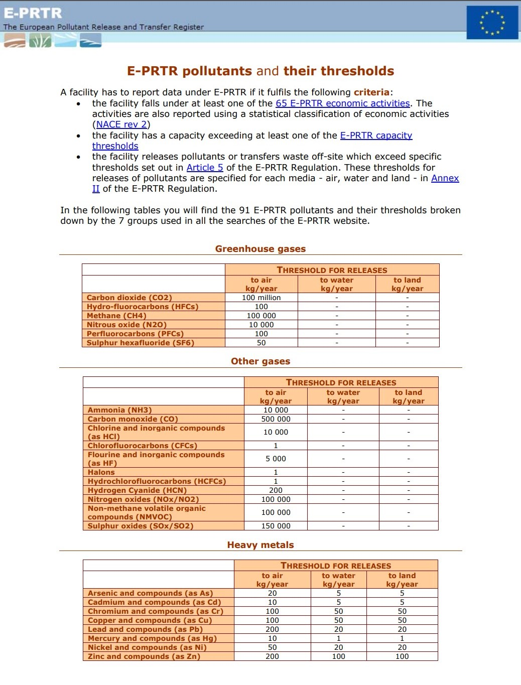
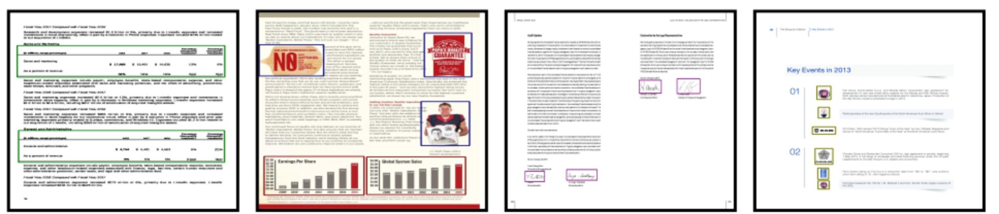
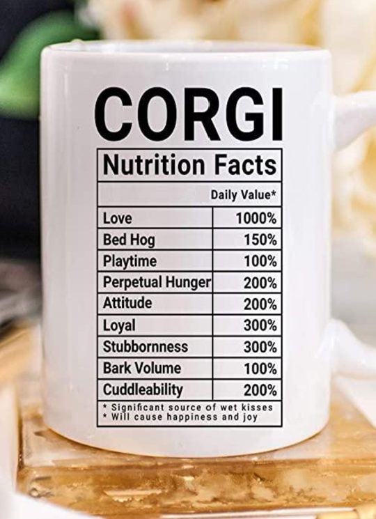
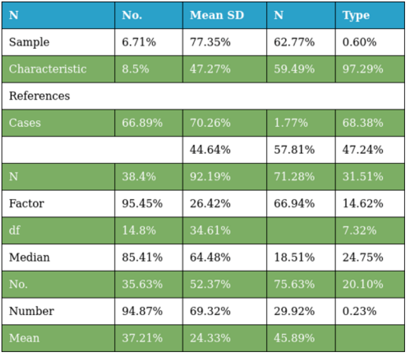
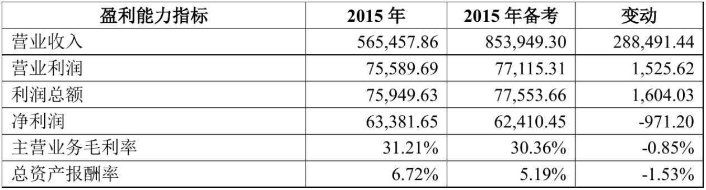
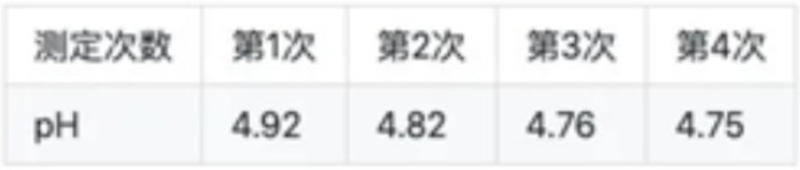

# Documenet AI Datasets

## Document Layout Analysis

|Dataset|Type|Description|Examples|Link|Permission|
|--|--|--|--|--|--|
|ICDAR 2013 Table Competition|Table|Datasets for the ICDAR 2013 Table Competition. Includes a total of **150** tables in PDF format: 75 tables in 27 excerpts from the EU and 75 tables in 40 excerpts from the US Government. An automatic text conversion using pdftk has also been included for convenience.||[ICDAR 2013 Table Competition](http://www.tamirhassan.com/html/competition.html)|-|
|Marmot-Dataset for table recognition|Table|**2000** pages in PDF format, the corresponding ground-truths were extracted utilizing the semi-automatic ground-truthing tool "Marmot". The dataset is composed of Chinese and English pages at the proportion of about 1:1.|-|1. [Marmot Dataset Homepage](https://www.icst.pku.edu.cn/cpdp/sjzy/index.htm)   2. [Marmot Dataset for table recognition](https://www.icst.pku.edu.cn/cpdp/docs/20190424190300041510.zip)|Research✅|
|Marmot-Dataset for layout analysis of fixed layout documents|Documents|Contains **244** pages selected from 35 PDF documents. Primitive objects of page content include text, images and graphics.|-|1. [Marmot Dataset Homepage](https://www.icst.pku.edu.cn/cpdp/sjzy/index.htm)   2. [Marmot Dataset for layout analysis of fixed layout documents](https://www.icst.pku.edu.cn/cpdp/docs/20190424193042344069.gz)|Research✅|
|PubTabNet|Table|Contains **568k+** images of tabular data annotated with the corresponding HTML representation of the tables||[PubTabNet(GitHub)](https://github.com/ibm-aur-nlp/PubTabNet)|[LICENSE.md](https://github.com/ibm-aur-nlp/PubTabNet/blob/master/LICENSE.md)|
|PubLayNet|Document|**360k+** document images, of which the layout is annotated with both bounding boxes and polygonal segmentations||[PubLayNet(GitHub)](https://github.com/ibm-aur-nlp/PubLayNet)|-|
|Document AI (MSRA)   TableBank|Table|Image-based table detection and recognition dataset, built with novel weak supervision from Word and Latex documents on the internet. Contains **417K** high-quality labeled tables|-|[TableBank(GitHub)](https://github.com/doc-analysis/TableBank)|-|
|Document AI (MSRA)   DocBank|Document|Large-scale dataset that is constructed using a weak supervision approach. Totally includes **500K** document pages, where 400K for training, 50K for validation and 50K for testing.|-|[DocBank(GitHub)](https://github.com/doc-analysis/DocBank)|Research✅   Commercial✅   Patent✅|
|IIIT-AR-13K|Business Documents|Business documents, more specifically annual reports. Contains a total of **13K** annotated page images with objects in five different popular categories — table, figure, natural image, logo, and signature.||[USODI IIIT-AR-13K Homepage](http://cvit.iiit.ac.in/usodi/iiitar13k.php)   [IIIT-AR-13K Dataset](http://cvit.iiit.ac.in/usodi/img/projects/detection/iiit-ar-13/dataset/IIIT-AR-13K_dataset.zip)|-|
|SciTSR|Table|SciTSR is a large-scale table structure recognition dataset, which contains 15,000 tables in PDF format and their corresponding structure labels obtained from LaTeX source files.||[SciTSR(GitHub)](https://github.com/Academic-Hammer/SciTSR)|Research✅   Commercial✅|
|WTW|Table|WTW-Dataset is the first wild table dataset for table detection and table structure recongnition tasks, which is constructed from photoing, scanning and web pages. It contains **14581** images with ground-truths.||[WTW(GitHub)]( https://github.com/wangwen-whu/WTW-Dataset)|Research✅  |
|ICDAR 2019|Table|**840** jpgs and xmls including bounding boxes of table in modern documents, **1149** jpgs and xmls including structure labels, bounding boxes of table and bounding boxes for each cell in archival documents.||[ICDAR 2019]( https://cndplab-founder.github.io/cTDaR2019/index.html)|-|
|SynthTabNet|Table|SynthTabNet is a dataset of **600k** png images from synthetically generated table layouts with annotations in jsonl files.||[SynthTabNet(GitHub)]( https://github.com/ibm/synthtabnet)|[LICENSE.md](https://github.com/IBM/SynthTabNet/blob/main/LICENSE.md)|
|FinTab|Table|Contains **1,685** PDFs with textual ground truth, structure information and the unit of the table.||[FinTab]( https://developer.ibm.com/exchanges/data/all/fintabnet/)|-|
|TAL|Table|The form recognition dataset is a collection of **1.6w** images from real-life educational scenarios where students have taken photos to search for questions, each providing the corresponding form structure and content annotation. ||[TAL]( https://ai.100tal.com/dataset)|-|

## Visual Information Extraction

|Dataset|Type|Description|Examples|Link|Permission|
|--|--|--|--|--|--|
|FUNSD|Form|A dataset for Text Detection, Optical Character Recognition, Spatial Layout Analysis and Form Understanding. Contains **199** fully annotated forms, with 31485 words, 9707 semantic entities and 5304 relations||[FUNSD](https://guillaumejaume.github.io/FUNSD/)|Research✅|
|ICDAR2019-SROIE-Task3|Receipts|Receipt images with annotations and key information, 636 for training and 347 for testing.||1. [ICDAR2019-SROIE Homepage](https://rrc.cvc.uab.es/?ch=13)   2. [Unofficial, **train data only**, with preprocessing codes](https://github.com/zzzDavid/ICDAR-2019-SROIE)   3. [👍Recommended] [Unofficial, full set with train and test data](https://pan.baidu.com/s/17lTKLphTPHD5gi2frULeog) (extraction code: ecmo)|Share✅   Adapt✅|
|CORD|Receipts|Over **11,000** Indonesian receipts collected from shops and restaurants, with five superclass and 42 subclass labels||[CORD(GitHub)](https://github.com/clovaai/cord)|Share✅   Adapt✅|
|DeepForm|Receipts|**20,000** labeled receipts from political television ads bought in the 2012, 2014, and 2020 US elections.|-|1. [GitHub Home Page of the Paper](https://github.com/jstray/deepform)   2. [DeepForm Dataset](https://drive.google.com/drive/folders/1bsV4A-8A9B7KZkzdbsBnCGKLMZftV2fQ?usp=sharing)|-|
|EATEN|Train ticket   Passport   Business card|Contains **300k** synthetic and **1.9k** real train ticket images, **100k** synthetic passport images, **200k** synthetic business card images.||[EATEN(GitHub)](https://github.com/beacandler/EATEN)|-|
|EPHOIE|Examination Paper Head|Contains **1,494** images which are collected and scanned from real examination papers of various schools in China, crop the paper head regions which contains all key information. The texts are composed of handwritten and printed Chinese characters in horizontal and arbitrary quadrilateral shape. Complex layouts and noisy background also enhance the generalization of EPHOIE dataset||[EPHOIE(GitHub)](https://github.com/HCIILAB/EPHOIE)|Research✅   Need application before use|
|Document AI (MSRA)   XFUND|Form|multilingual form understanding benchmark dataset that includes human-labeled forms with key-value pairs in 7 languages (Chinese, Japanese, Spanish, French, Italian, German, Portuguese)|-|[XFUND(GitHub)](https://github.com/doc-analysis/XFUND)|Share✅   Adapt✅|
|WildReceipt|Receipts|1740 receipts in English, 1268 for training and 472 for testing. ||[WildReceipt(From MMOCR)](https://github.com/open-mmlab/mmocr/blob/12558969ee6f11b469a8e964a57730d5df3df6b1/docs/en/datasets/kie.md)|-|
|Kleister|Contracts and Financial Reports|Two subsets: NDA(Contracts, 540 documents, 3229 pages) and Charity(Financial Reports, 2788 documents, 61643 pages) |-|1. [Kleister NDA](https://github.com/applicaai/kleister-nda)   2. [Kleister Charity](https://github.com/applicaai/kleister-charity)|-|
